[Home](https://github.com/kanishkegb/CSCI-6527-projects)
# Project 4: Humpback Whale Identification Challenge

<a name="contents"></a>
## Contents
1. [Introduction](#intro)
2. [Basic Classifier with Scikit-Learn](#basic_clf)
3. [Image Cropper with TensorFlow](#cropping)
4. [Combining Classifier with Cropped Images](#combined)
5. [Conclusions and Future Improvements](#summary)
6. [Running the Code](#running)

I am completely new to machine learning. In fact this is my first experiment with machine learning. So I decided to do this on my own so that I can learn everything. Further, after my initial research, I found both [scikit-learn](http://scikit-learn.org/) and [TensorFlow](https://www.tensorflow.org/). So I decided to use this project to learn both of these.

[[Back to top](#contents)]
<a name="intro"></a>
## 1. Introduction
Whaling has been a practiced for many centuries by human at different areas/countries of the world, mainly for meat and whale oil. After the industrialization of the whaling at the 17th century, competitive whaling nations exponentially increased, leading to kill around 50,000 whales a year by 1930s ([see details](http://www.thecanadianencyclopedia.ca/en/article/whaling/)). This resulted in rapid depletion of the most of the known whale stocks around the world. As a result, the International Whaling Commission (IWC) banned commercial whaling in 1986, while imposing whaling quotas instead of a total ban on few traditionally whaling nations. The graph below shows how the whaling changed over the course of years for reported data from few whaling nations (image from [Wikipedia](https://en.wikipedia.org/wiki/Whaling#/media/File:Whales_Nordic.png)).

<center>
  
</center>

After centuries of those intense whaling, the whales are still in the recovery step. Further, they have to deal with man-made environmental disasters such as global warming. The anti-whaling movement use photo surveillance for their whale conservation efforts. The shape and the unique markings on the whale's tale/fluke (see image below) to identify the each whale species and track their motions and behaviors.

<center>
  
</center>

Currently, the identification is done manually. The [Kaggle](https://www.kaggle.com/c/whale-categorization-playground) initiated a project to help automate the whale identification. The challenging part is the low number imagery from the each type of whale. I thought I would contribute to this project for my final project. Since this is my first machine learning experience, this way, I get to learn machine learning while helping to save thousands of whales all around the world!

[[Back to top](#contents)]
<a name="basic_clf"></a>
## 2. Basic Classifier with Scikit-Learn

Basically, Kaggle provides a set of training data and a set of test data. The training data consist of 9000+ manually labeled image of flukes of different whale species and test data has 15,000 unlabeled data.  The objective is to train a classifier using the train data to identify the each fluke in the test data. The predictions can be updated to the Kaggle website where they check it, score the predictions and put the scores in a [leaderboard](https://www.kaggle.com/c/whale-categorization-playground/leaderboard).

Given that this is my first machine learning project, I started small. First thing I tried was using a basic classifier to classify data. I used scikit-learn for this part and choose the Support Vector Machine based on their documentation.

<center>
  
</center>

Then I ran the SVM classifier with raw data, without doing any manipulations to data. Running the classifier without doing any modifications did not yield good results, as expected (see [Running the code](#running) for details on how to run the code). The provided raw training data include flukes on different backgrounds and at different angles which makes the training process less accurate.  See below images.

<center>
  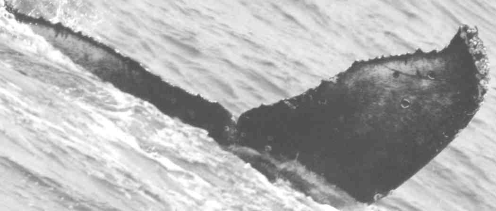
  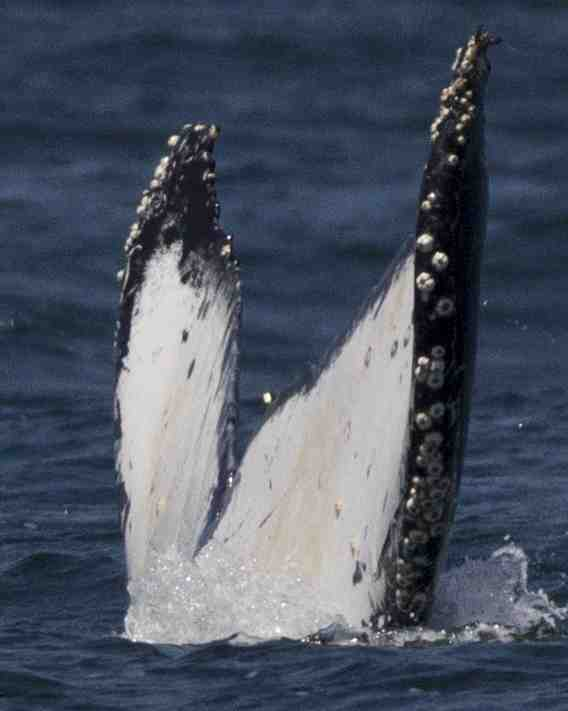
  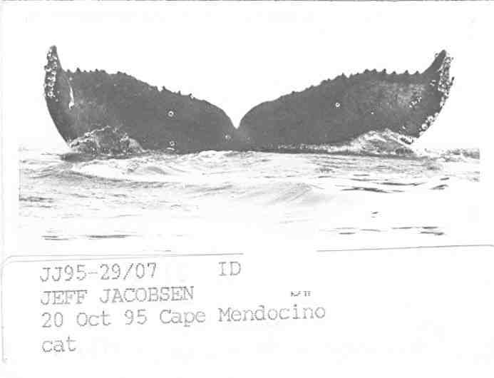
</center>

The Kaggle website scores the predictions submitted by the contesters. Score ranges between 0.0 and 1.0 where 1.0 is the highest score one can achiever. This submission scored a whopping 0.00550 :grinning:! So I had to some improvements.

<center>
  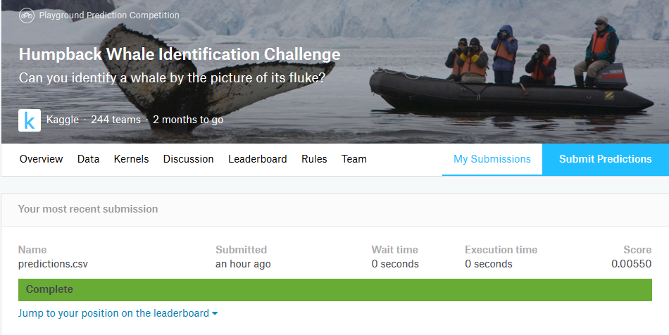
</center>

[[Back to top](#contents)]
<a name="cropping"></a>
## Image Cropper with TensorFlow
To reduce the background noise and to make it easier for the classifier to learn the flukes, I decided to use TensorFlow to automatically detect the fluke in the image and crop it. For this I used the TensorFlow object detection API. Below images show the detected flukes and the cropped image based on that.

<center>
  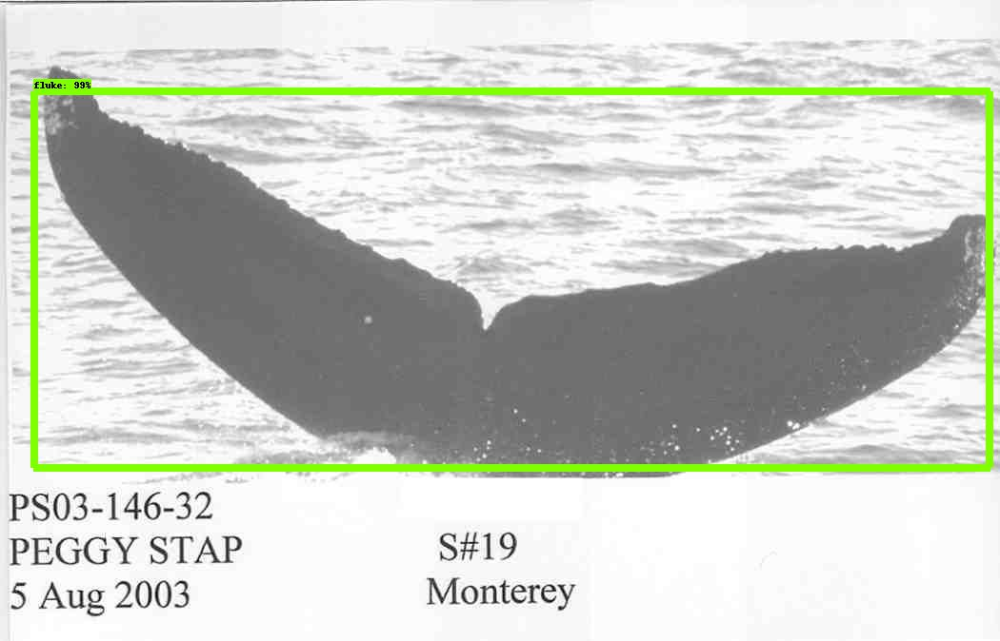
  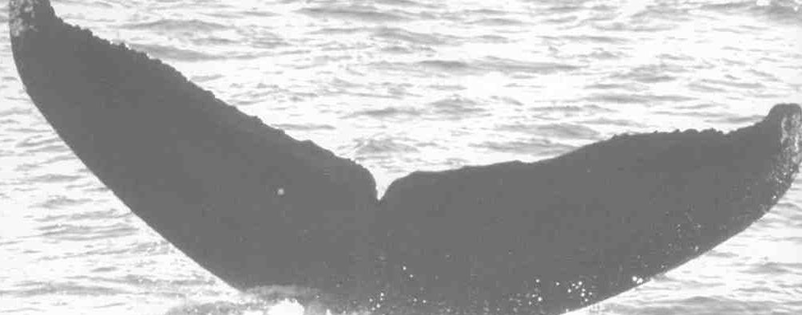
</center>
<center>
  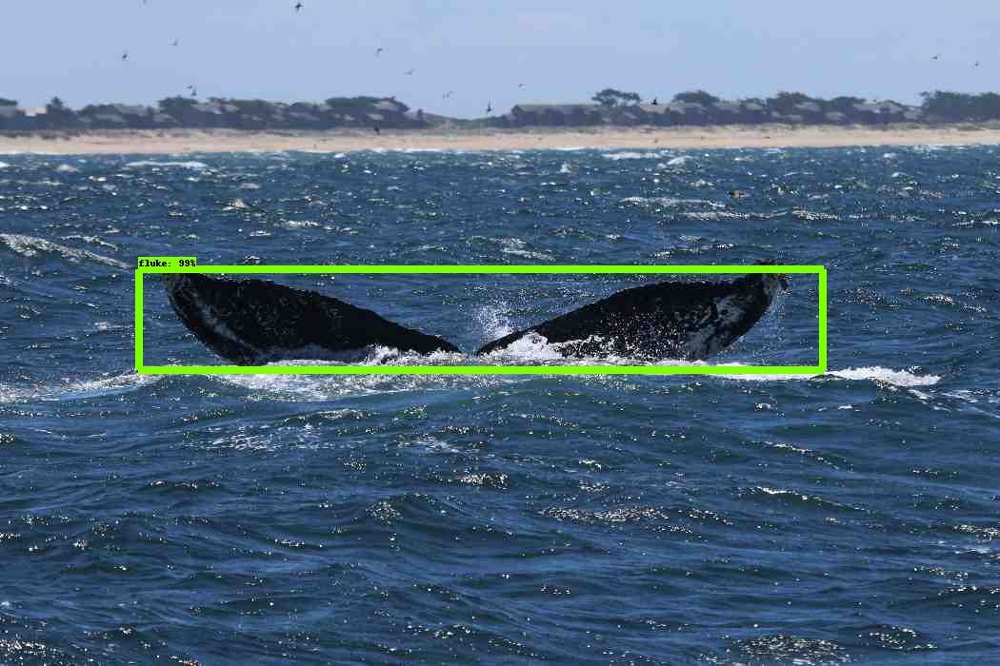
  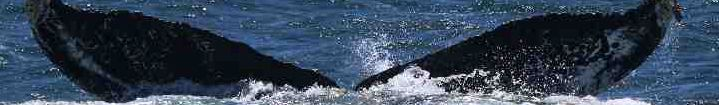
</center>
<center>
  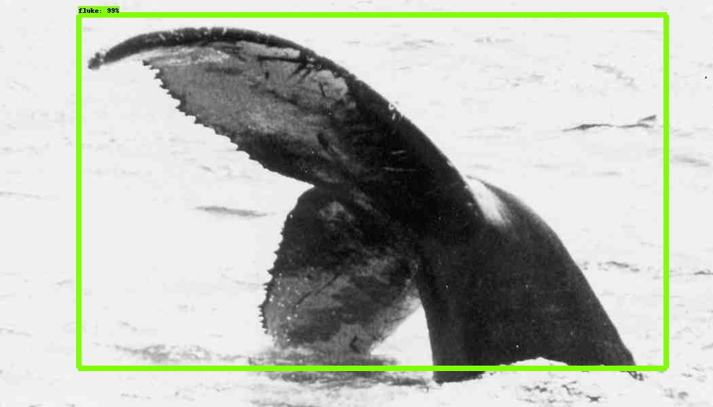
  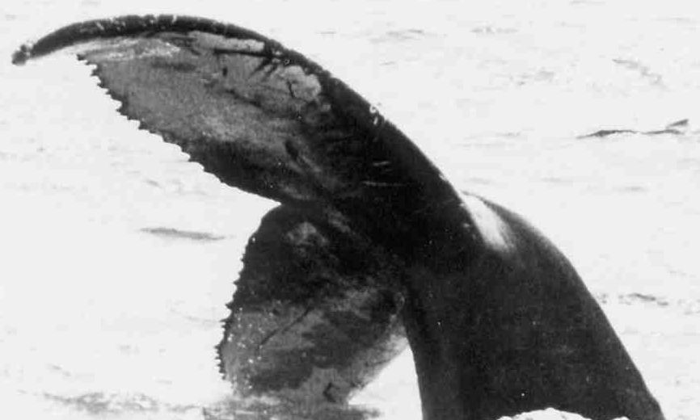
</center>
<center>
  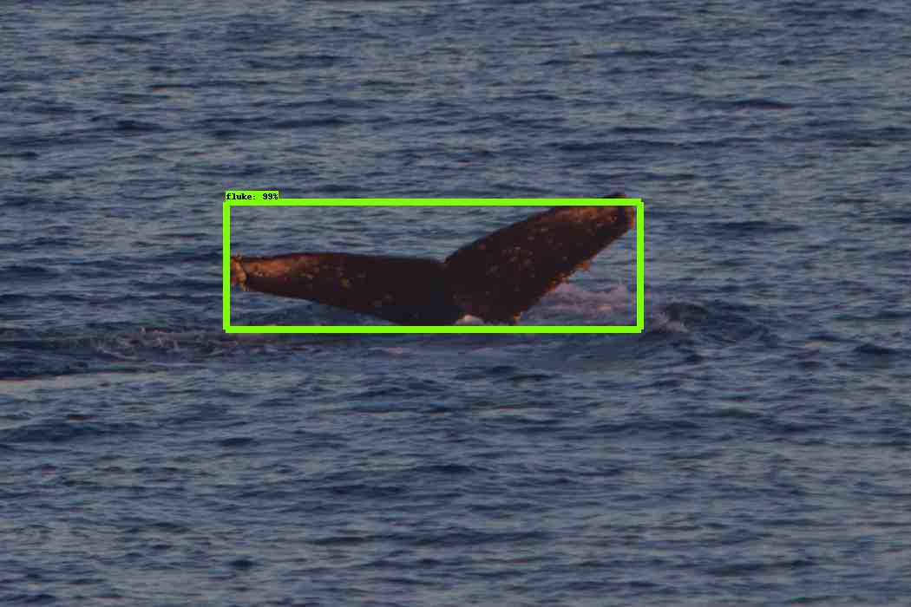
  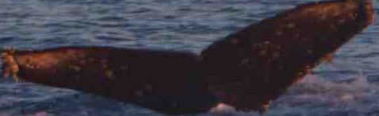
</center>

Instructions for running the TensorFlow model can be found in [Running the code](#running).


[[Back to top](#contents)]
<a name="combined"></a>
## Combining Classifier with Cropped Images
As described previously, the basic classifier did perform poorly. Therefore, a TensorFlow model for cropping the image was developed. I ran this fluke detection and cropping machine learning model on both training and testing data first. The classifier was then run on the cropped data. The results show that the cropping improved the accuracy of the predictions. I scored 0.10121 ! :muscle:

<center>
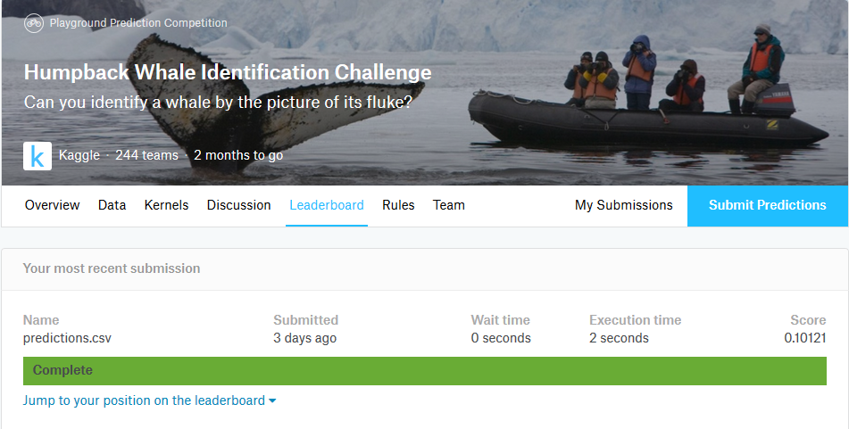
</center>


[[Back to top](#contents)]
<a name="summary"></a>
## Conclusions and Future Improvements
Basically, I used this project as my "Machine Learning 101" project. I managed to do following things during the last few weeks:
1. Configure and trained a support vector machine using scikit-learn to classify the whales based on their fluke images
2. Improve the accuracy of the classifier by training a TensorFlow object detection model to detect the fluke inside the image and crop out the surroundings

This is not the best results and did not even make to the top 50% in the leaderboard at the time of submission, but I am happy about the progress I made on this project.

Following things were planned to do, but could not be achieved before the deadline.
1. Developing a segmentation model based on TensorFlow to extract only the fluke from the background
  <center>
    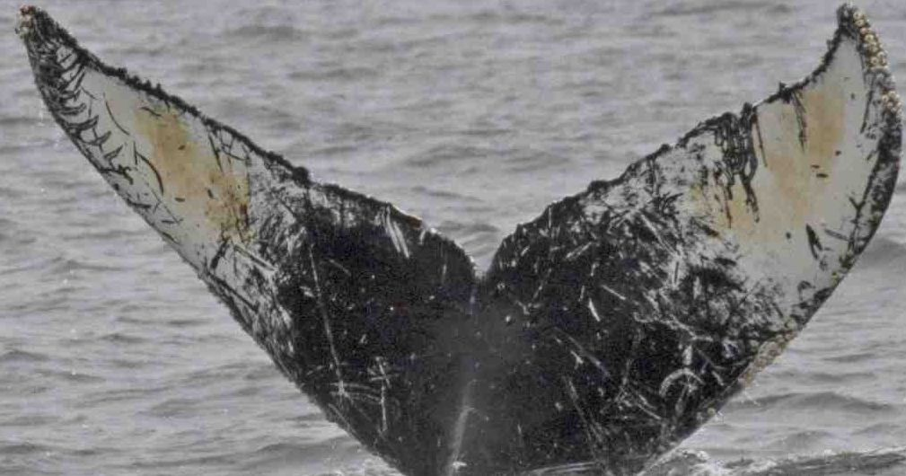
    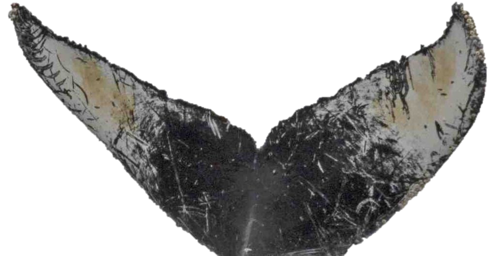
  </center>
2. Do a perspective/rotations transformation on possible extracted whale fluke such that each fluke can be viewed as an image take from the same angle.

Doing the suggested changes may improve the accuracy of the predictions more. Hopefully, during the summer I might get some time to improve my results. 


[[Back to top](#contents)]
<a name="running"></a>
## Running the code

A zip file can be downloaded [here](). <!-- TODO: update the link -->
The images are uploaded to a Google Drive folder to reduce the repository size. Unzip the zip file and move `Whale_ID` directory containing all the subdirectories and files must be copied to the parent directory of this repository. The file structure should be like below:
```
+ parent_dir (this could be any directory)
    + CSCI-6527-projects
        - cropping
        - data
        - ...
    + Whale_ID
        - test
        - train
        - sample_submission.csv
        - ...
```

### Basic Classifier
Simply run the below code to run the simple classifier with scikit-learn.
```
python identify_learn.py -a -r -t
```

### Cropping
#### Creating the virtual environment
1. Create a virtual environment
  ```
  conda update -n base conda  # optional
  conda create --name ML
  conda activate ML
  conda install numpy
  conda install scikit-learn
  conda install cython
  pip install --ignore-installed --upgrade tensorflow
  sudo apt-get install protobuf-compiler python-pil python-lxml
  conda install pillow
  conda install matplotlib
  conda install pandas
  conda install h5py
  ```
2. Clone this repository
  ```
  git clone git@github.com:kanishkegb/CSCI-6527-projects.git
  ```
3. Clone and configure object detection API from TF (do this in a ***different*** directory)
  ```
  cd /to/a/different/directory
  git clone git@github.com:tensorflow/models.git
  cd models/research/
  protoc object_detection/protos/*.proto --python_out=.
  export PYTHONPATH=$PYTHONPATH:`pwd`:`pwd`/slim
  # on Windows computers, you need to manually add these paths to the system variables
  ```
4. Test the installation
  ```
  python object_detection/builders/model_builder_test.py
  ```

#### Annotating Data
**NOTE**: This section is not required if the same data is used. This section as added solely for the completeness of the documentation.

1. Install and use [LabelImg](https://github.com/tzutalin/labelImg) to open each whale figures in train images and to annotate the fluke of the whale. This will create a list of xml files (the xml files in `cropping\annotations\xml`) were generated using this method. Annotating around 200 images is fine. Of course more images makes your predictions more accurate.

2. Then, convert these data to CSV format so that TF can understand them.
  ```
  python xml_to_csv.py
  ```
  This will generate the `whale_flukes.csv` file inside `cropping\annotations`. Then, copy the CSV file to the `data` directory and rename the file to `train_labels.csv`. Move around 20 entries from that file to a new file named `test_labels.csv`. Remember to copy the headers row to the new CSV file.
3. Duplicate the images that were annotated to a different directory. The below script will automate that process once you create the `whale_flukes.csv`.
  ```
  python duplicate_cropped_images.py
  ```

#### Training
1. Clone the [TF models](https://github.com/tensorflow/models) to a ***different*** directory (this is same as the step 3 in the creating virtual environment section)
  ```
  git clone git@github.com:tensorflow/models.git
  ```
2. Cloning the models repo will create a directory called "models". Copy below files to the `models\research` directory.
  1. all the sub directories and the files in the `Project-4\cropping` directory (everything inside, not the `cropping` directory).
  2. `crop_train` directory inside `Whale_ID` directory, and make sure to rename `crop_train` to `images`
3. Download and copy a pre-trained for object detection model:
  ```
  wget http://download.tensorflow.org/models/object_detection/ssd_mobilenet_v1_coco_11_06_2017.tar.gz
  tar -xvzf ssd_mobilenet_v1_coco_11_06_2017.tar.gz
  ```
  Copy all the files inside the unzipped directory to `models\research\data`
4. Create a directory to save data
  ```
  cd models\research
  mkdir fluke_crop
  ```
5. Generate TF train and test records:
  ```
  python generate_tfrecord.py --csv_input=data/train_labels.csv  --output_path=data/train.record
  python generate_tfrecord.py --csv_input=data/test_labels.csv  --output_path=data/test.record
  ```
6. Train:
  ```
  python object_detection/train.py --logtostderr --pipeline_config_path=training/ssd_mobilenet_v1_pets.config --train_dir=fluke_crop/
  ```

#### Predicting
1. Export the trained model as a protocol buffer. Make sure to replace `<checkpoint>` with the latest checkpoint available in the `models/research/fluke_crop` directory. Ex: `--trained_checkpoint_prefix fluke_crop/model.ckpt-12313`
  ```
  # cd models/research/
  python object_detection/export_inference_graph.py \
   --input_type image_tensor \
   --pipeline_config_path training/ssd_mobilenet_v1_pets.config \
   --trained_checkpoint_prefix fluke_crop/model.ckpt-<checkpoint> \
   --output_directory output_inference_graph.pb
  ```
2. Make directories to save the predicted images.
  ```
  cd models/research/
  mkdir test_predicted_images  # for testing predictions
  mkdir predicted_test_images  # for final predictions
  mkdir predicted_train_images  # for final predictions
  mkdir cropped_test_images  # for cropped image
  mkdir cropped_train_images  # for cropped image
  ```
3. Test the predictions first. For this, first copy the file `test_predict.py` to `models/research/object_detection` directory. Then run the following commands.
  ```
  cd models/research/object_detection
  python test_predict.py
  ```
  This will generate the predicted images inside the `models/research/test_predicted_images` directory. If these look good, run the below commands to crop the real test data.
4. Predict the test images in `Whale_ID`. For this, first copy the file `predict_train.py` and `predict_test.py`to `models/research/object_detection` directory. Then run the following commands.
  ```
  cd models/research/object_detection
  python predict_train.py
  python predict_test.py
  ```
  Each of these will generate the predicted images inside the `models/research/predicted_train_images` and `models/research/predicted_test_images` directory. Further, the cropped images can be found in `models/research/cropped_train_images` and `models/research/cropped_test_images`. Use those figures to run the classifier.

[[Back to top](#contents)]
