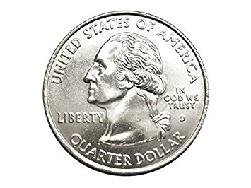
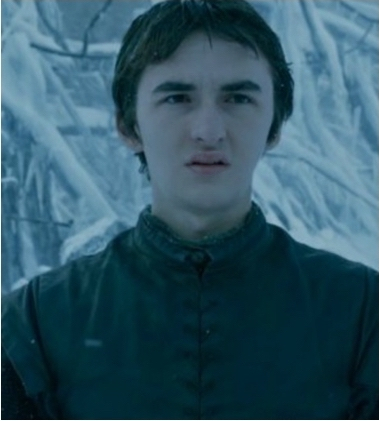
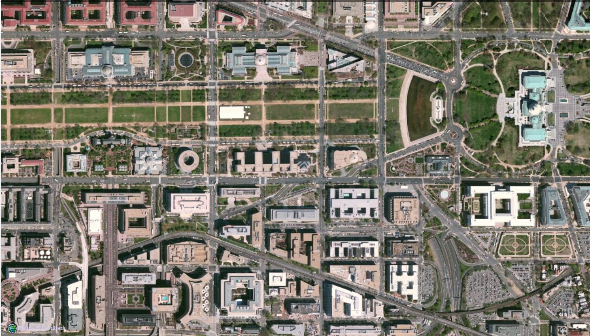

[Home](index)

# Project 3: Stereo and Depth

## Contents
1. [Introduction](#intro)
2. [Procedure](#procedure)
3. [Gallery](#gallery)

## 1. Introduction
An autostereogram is basically an optical illusion that trick your eye to see depth in a 2D image. This became popular in 1990's as _Magic Eye_. The objective of this project is to generate an autostereogram from a given depth map.

  

  

Above is an example for an autostereogram. If you need any help viewing the image, please visit the [original web page](http://www.magiceye.com/faq_example.htm) for instructions, where this was published.

[back to contents](#contents)

## 2. Procedure

For more cool images, check the [gallery](#gallery) below.

[back to contents](#contents)

## 3. Gallery

Do you remember that day when you had to pick a decision from two, and you already knew which decision you want to take, but you still went with the coin hoping the coin will pick the decision you want? Well, use this coin next time!  

  
  

  

original images:  

  
  

  

If you are a Game of Thrones fan, you are going to be a bit disheartened by the next image. All the GOT fans (maybe most of them) want Daenerys Targaryen and Jon Snow to kill the Night King (and of course Cersei Lannister). But, did you know that Bran Start is actually the Night King? You don't believe me? Check out this.  

  
  

  

original images:  

  
  

  

Okay, enough of fictional characters. Let's see something technical. We all use Google Maps in a day to day basis. Most of them the time we stick with the "Default mode" where we see digitally colored version of the satellite imagery. Below are hybrid images of both the digital map and the satellite imagery.

  
  

  

original images:  

  
  

  

  
  

  
original images:  

  
  

  

Finally, an orange. Because who doesn't love oranges!

  
  

  

original images:  

  
  

  
